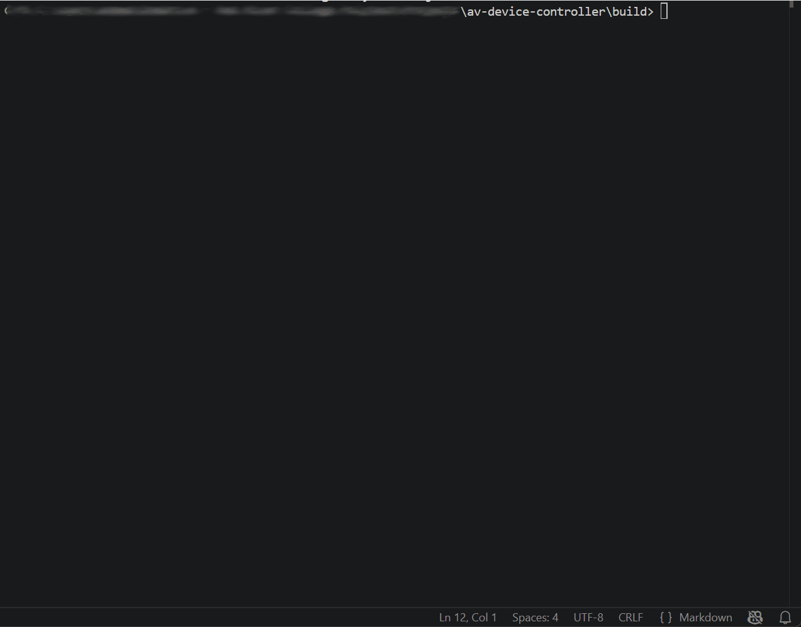
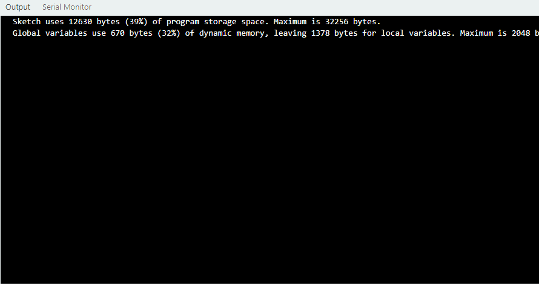

# AV Device Controller



A C++17 command-line system that simulates centralized control of multiple AV displays extended to real hardware via an Arduino + BME280 sensor over I2C.

Built as a portfolio piece exploring layered architecture, defensive input
handling, and the kind of control logic that runs underneath commercial AV
automation products.

---

## Demo
$ ./av_controller
[SYSTEM] Loaded 5 displays from ../config/displays.cfg
AV Device Controller v1.0
Type HELP for commands. Type QUIT to exit.

ALL SET_POWER ON
[OK] Display 1 executed: SET_POWER
[OK] Display 2 executed: SET_POWER
[OK] Display 3 executed: SET_POWER
[OK] Display 4 executed: SET_POWER
[OK] Display 5 executed: SET_POWER


DISPLAY 2 SET_VOLUME 75
[OK] Display 2 executed: SET_VOLUME


DISPLAY 3 SET_INPUT AV
[OK] Display 3 executed: SET_INPUT


DISPLAY 2 SET_VOLUME 999
[ERROR] Volume must be 0-100


STATUS
[Display 1 | MainBar]   Power: ON | Input: HDMI | Vol: 50% | Bright: 80% | Temp: 36.2C
[Display 2 | PoolTable] Power: ON | Input: HDMI | Vol: 75% | Bright: 80% | Temp: 37.4C
[Display 3 | Entrance]  Power: ON | Input: AV   | Vol: 50% | Bright: 80% | Temp: 35.8C
[Display 4 | Patio]     Power: ON | Input: HDMI | Vol: 50% | Bright: 80% | Temp: 62.1C  WARNING: HIGH TEMP
[Display 5 | BackRoom]  Power: ON | Input: HDMI | Vol: 50% | Bright: 80% | Temp: 34.9C
[ALERT] Display 4 temperature critical: 62.1C


QUIT
Shutting down. Goodbye.


---
## Hardware extension

The controller's temperature monitoring was extended to real hardware:
an Arduino Uno reading temperature, humidity, and pressure from a BME280
sensor over I2C. The same threshold-based alert from the simulation fires
when the live sensor reading crosses the configured limit.



## Features

- Control any single display by ID, or broadcast a command to every display at once
- Live, simulated temperature on each display with configurable threshold alerts
- Append-mode, timestamped event log written to `logs/events.log`
- Display configuration loaded from `config/displays.cfg` — add, remove, or
  rename displays without recompiling
- Layered error handling with command-specific, human-readable messages
- Case-insensitive command parsing; comment and blank-line support in config
- Unit tests for the parser (`test_parser` executable) and file-driven integration tests

---

## Architecture
              User input (typed text)
                      │
                      ▼
               ┌────────────┐
               │   Parser   │   →  ParsedCommand { isAll, displayId,
               └────────────┘                       command, args }
                      │
                      ▼
            ┌────────────────┐
            │   Controller   │   owns vector<Display>, routes commands,
            └────────────────┘   handles broadcast, manages tick cycle
              │      │      │
              ▼      ▼      ▼
        ┌────────┐ ┌──────┐ ┌──────┐
        │Display │ │Logger│ │Alert │
        └────────┘ └──────┘ └──────┘
        state +    append    over-
        validation log file  temp scan

Each layer has one job. The parser knows about the command-string grammar
and nothing else. The controller knows what commands exist and how to dispatch
them. The Display owns its state and validates every change. The logger and
alert modules are passive consumers of controller-level events.

This split means the CLI front-end is swappable: replace `parse(...)` with
a JSON deserializer and the controller, displays, logger and alert would
not change a line.

---

## Project Structure
av-device-controller/
├── include/              header files (.h)
│   ├── display.h
│   ├── parser.h
│   ├── controller.h
│   ├── logger.h
│   └── alert.h
├── src/                  implementation files (.cpp)
│   ├── main.cpp          entry point + REPL loop
│   ├── display.cpp
│   ├── parser.cpp
│   ├── controller.cpp
│   ├── logger.cpp
│   └── alert.cpp
├── tests/
│   ├── test_parser.cpp   parser unit tests (separate executable)
│   └── test_input.txt    scripted commands for integration testing
├── config/
│   └── displays.cfg      "id name" pairs, one per line
├── logs/
│   └── events.log        auto-generated, gitignored
├── CMakeLists.txt
├── .clang-format
└── README.md

---

## Build

### Prerequisites

- A C++17 compiler (g++ 7+, clang++ 5+, or MSVC 2017+)
- CMake 3.14 or newer

On Windows, the recommended toolchain is MSYS2 with the UCRT64 environment
(`pacman -S mingw-w64-ucrt-x86_64-gcc mingw-w64-ucrt-x86_64-cmake mingw-w64-ucrt-x86_64-make`).
On macOS, `brew install cmake` (g++ ships with Xcode CLI tools). On Ubuntu,
`sudo apt install g++ cmake`.

### Build steps

```bash
mkdir build
cd build
cmake ..                    # on Windows with MinGW: cmake .. -G "MinGW Makefiles"
cmake --build .             # or `make` / `mingw32-make`
```

After a successful build, `build/` contains two executables: `av_controller`
(the main program) and `test_parser` (the unit-test runner).

---

## Usage

### Interactive

From inside `build/`:

```bash
./av_controller
```

The program loads `../config/displays.cfg`, then drops into an interactive
prompt. Type `HELP` for the command list, `QUIT` to exit.

### Scripted (file-driven)

The same binary can be driven from a text file by piping it into stdin:

```bash
# bash / cmd
./av_controller < ../tests/test_input.txt

# PowerShell
Get-Content ..\tests\test_input.txt | .\av_controller.exe
```

---

## Command Reference

| Command                             | Example                          | Description                          |
| ----------------------------------- | -------------------------------- | ------------------------------------ |
| `DISPLAY <id> SET_POWER ON\|OFF`     | `DISPLAY 1 SET_POWER ON`         | Power one display on or off          |
| `DISPLAY <id> SET_VOLUME 0-100`     | `DISPLAY 2 SET_VOLUME 60`        | Set the volume on one display        |
| `DISPLAY <id> SET_BRIGHTNESS 0-100` | `DISPLAY 3 SET_BRIGHTNESS 75`    | Set the brightness on one display    |
| `DISPLAY <id> SET_INPUT HDMI\|AV\|DP` | `DISPLAY 1 SET_INPUT HDMI`     | Switch the input source              |
| `ALL <command> [args...]`           | `ALL SET_POWER ON`               | Broadcast to every display           |
| `STATUS`                            | `STATUS`                         | Show the current state of every display |
| `HELP`                              | `HELP`                           | Print this list                      |
| `QUIT`                              | `QUIT`                           | Exit the program                     |

Input is case-insensitive — `display 1 set_volume 60` works the same as the
uppercase form.

---

## Configuration

Displays are listed in `config/displays.cfg`, one per line, as `id name` pairs.
Comments (lines starting with `#`) and blank lines are ignored.
AV Device Controller — display configuration
1 MainBar
2 PoolTable
3 Entrance
4 Patio
5 BackRoom

To add, remove, or rename a display, edit this file and restart the program.
No recompilation needed.

---

## Logging

Every successful command produces a timestamped entry in `logs/events.log`:
14:22:01 [Display 1] SET_POWER = ON
14:22:15 [Display 2] SET_VOLUME = 75
14:22:28 [Display 3] SET_INPUT = AV

Failed commands (invalid input, unknown displays, validation errors) are NOT
logged — the log is reserved for confirmed state changes.

---

## Testing

### Parser unit tests

```bash
cd build
./test_parser
```

Output:
=== Parser unit tests ===
[PASS] testBasicDisplayCommand
[PASS] testAllCommand
[PASS] testDirectCommand
[PASS] testLowercaseInput
[PASS] testMultipleArgs
[PASS] testEmptyInputThrows
[PASS] testDisplayMissingPartsThrows
[PASS] testAllMissingCommandThrows
[PASS] testNonNumericIdThrows
All tests passed!

### File-driven integration test

```bash
./av_controller < ../tests/test_input.txt
```

The test script exercises happy paths, every error class, and the broadcast
deduplication.

---

## Design Notes

- **CLI rather than GUI** — The project intentionally focuses on the control
  layer beneath any user-facing interface. The parser is the only piece that
  knows about the text command format; substituting a different front-end
  (web UI, REST API, mobile app) would not touch the controller or displays.

- **No external dependencies** — Pure C++17 standard library. Build is one
  CMake invocation. Keeps the project portable and the audit surface small.

- **Errors propagate up, validation pushes down** — Each layer enforces the
  rules it owns. The parser catches structural errors (empty input, missing
  tokens). The controller catches command-level errors (unknown command,
  wrong argument type). The Display catches value rules (volume 0-100, input
  ∈ HDMI/AV/DP). Every error path returns to the REPL prompt — the program
  never crashes on bad input.

- **Logged events are confirmed events** — Logging happens after a successful
  `Display::setX` call, never before. The log is therefore an audit trail of
  actual state changes, not attempted ones.

---

## Real-World Context

Bars and restaurants with 10–30 displays do this manually today: staff walk
between screens before opening to power them on, switch inputs, set volumes,
and again at close to power down. Mid-shift, overheating screens get noticed
only after they shut themselves off.

This project simulates the kind of control layer that AV automation products
build on top of — the deterministic, scriptable, audit-logged surface that a
touchscreen UI or web dashboard sits over. It's deliberately a simplified
take, but the architecture (parser → controller → device with logging and
alerts) is the same shape you'd see in real firmware.

---

## License

MIT — see [LICENSE](LICENSE) for details.

---

## Author

**Mahfuj Ahmed**
[GitHub](https://github.com/mahfuj02) · [Email](mailto:ahmedmahfujsy@gmail.com)


